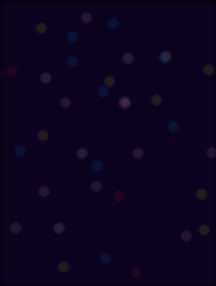
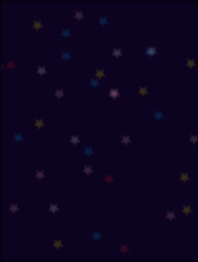
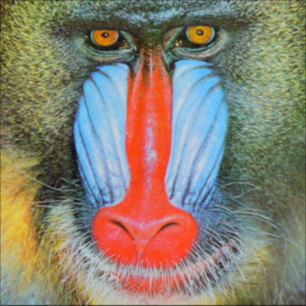
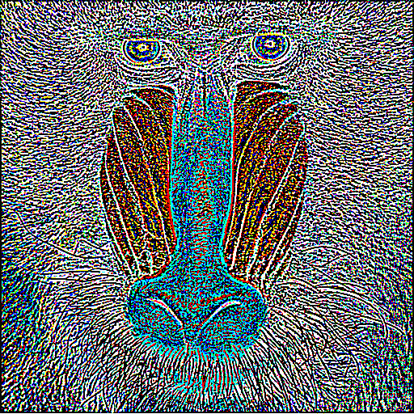
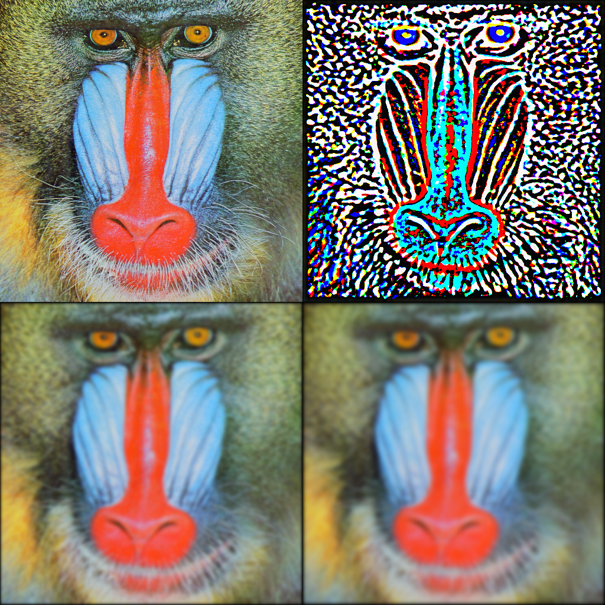

# Image Processing in Julia

This repository contains a collection of image processing algorithms written in Julia. Some of them take advantage of the CUDA module to run on an NVidia GPU.

## Processes

### Kuwahara

An implementation of the basic [Kuwahara filter](https://en.wikipedia.org/wiki/Kuwahara_filter). This filter creates a an oil painting-esque look. I've not (yet?) implemented more advanced versions of the Kuwahara filter like the Generalized version. The traditional version does have a blocky appearance and doesn't preserve edges very well.

| Original | Kuwahara |
|----------|----------|
|||


The results are deterministic, although the GPU and CPU versions' outputs vary slightly as can be seen below:


I believe this results from some minor bug in the GPU version that I've not yet resolved.

#### [Kuwahara CPU](/src/Kuwahara.jl)

This takes advantage of however many threads are available to Julia.

```julia
kuwahara(image_in, region_size::Int=13)
```

#### [Kuwahara GPU](/src/KuwaharaGpu.jl)

This uses an NVidia GPU to dramatically speed up the process. The difference in performance is especially seen with larger region sizes. The code took much more effort as it seems that many standard functions (such as `sum`, `map`, `std`, etc) cannot be used in a kernel, and thus have to essentially be re-invented.

```julia
kuwaharaGpu(image_in, 
    region_size::Int = 13, 
    threads_per_block::Int = 256)
```

### Bokeh Blur

This is a blur effect that is able to imitate the [Bokeh](https://en.wikipedia.org/wiki/Bokeh) effect that occurs in cameras. An image to blur and an aperture can be passed in. The aperture should be a greyscale images which will be used to blur the source image. Points of light blurred with this filter will take the shape of the white part of the aperture.

Note that if a pure white square image is used as the aperture, then this blur is equivalent to a [box blur](https://en.wikipedia.org/wiki/Box_blur).

The results are deterministic, and the GPU and CPU versions' seem to output the exact same image.

| Original | default aperture (box blur) | circle aperture | star aperture |
|----------|--------------------|-----------------|---------------|
|||||
|||||

This can also be used with specific matrices to approximate a [Gaussian blur](https://en.wikipedia.org/wiki/Gaussian_blur).

For example, using the following matrix results in a `5x5` Gaussian blur effect:

```julia
ImageProcessing.bokehBlur(testimage("mandrill"), [1 4 6 4 1; 4 16 24 16 4; 6 24 36 24 6; 4 16 24 16 4; 1 4 6 4 1] / 256)
```


and the following results in a [difference of Gaussians](https://en.wikipedia.org/wiki/Difference_of_Gaussians) (of a `3x3` and `5x5` approximation):

```julia
ImageProcessing.bokehBlur(testimage("mandrill"), [1 2 1; 2 4 2; 1 2 1] / 16) - ImageProcessing.bokehBlur(testimage("mandrill"), [1 4 6 4 1; 4 16 24 16 4; 6 24 36 24 6; 4 16 24 16 4; 1 4 6 4 1] / 256)
```


Running multiple iterations can make the effect stronger; the following is from 16 iterations:



Mathematically, this effect is just convolution with an arbitrary image (or `nxm` array of values between 0 and 1) used as the kernel, then normalized. It doesn't accept values outside of that range because I've used the `Gray` datatype for the kernel. It should be pretty simple for me to generify this in the future to support convolution by any `nxm` matrix which will make it easy for me to implement effects like the Sobel operator, sharpening, etc. 

#### [Bokeh Blur CPU](src/BokehBlur.jl)

This takes advantage of however many threads are available to Julia.

```julia
bokehBlur(image_in, aperture=ones(Gray, 12, 12))
```

#### [Bokeh Blur GPU](src/BokehBlurGpu.jl)

This uses an NVidia GPU to speed up the process.

```julia
bokehBlurGpu(image_in,
    aperture=map(Gray, ones(12, 12)),
    threads_per_block::Int=256)
```

## Testing

No unit tests written yet, however there is [a util](/src/Test.jl) to play around with these processors and display the output side-by-side with the input.

```julia
testKuwahara(img_name::String="mandrill";
    region_size::Int=13,
    use_gpu::Bool=false,
    threads_per_block::Int=512)
```

```julia
testBoxBlur(img_name::String="mandrill";
    box_size::Int=12,
    use_gpu=false,
    threads_per_block::Int=512)
```

```julia
testCircleBokehBlur(img_name::String="mandrill";
    use_gpu=false,
    threads_per_block::Int=512)
```

```julia
testStarBokehBlur(img_name::String="mandrill";
    use_gpu=false,
    threads_per_block::Int=512)
```

```julia
testGaussianBlur(img_name::String="mandrill";
    iterations::Int=1,
    use_gpu=false,
    threads_per_block::Int=512)
```

## On Edges

So far, every effect I've implemented takes a sample of values surrounding a pixel to determine what that pixel's value should be. When a pixel lies on the edge of the image, there isn't a set in stone way to decide how the algorithm handles pixels that are outside the image bounds. I've not seen a ton of opinions on what the best handling of this is. There are [a few different ways of handling it that I've seen outlined](https://en.wikipedia.org/wiki/Kernel_(image_processing)#Edge_handling). I naturally have chosen the "Kernel Crop" approach, which ignores anything outside the bounds and adjusts the normalization to compensate. This does however seem to lead to a slight vignette effect on the image, at least in the case of the bokeh blur.

Interestingly, I suspect for the Kuwahara filter the "Kernel Crop" approach leads to the same result as the Extend approach, or certainly at least will lead to a very similar result. I do also want to try the Extend approach for the bokeh blur, as I think it should be the best option to get rid of the vignette in most cases.
